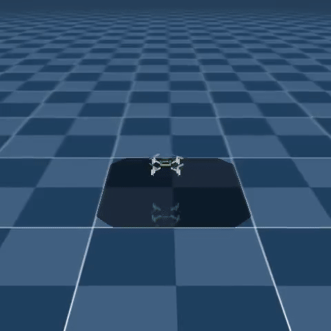

# Automous Drone Navigation using Reinforcement Learning

## Drone Hovering
Move the drone to a spot right above it and have it stay in the area. The spot stays in the same location for each run.

## Random Point 
Move the drone to a random spot and have it stay in the area. The spots location changes for each run.

## Multiple Targets

## Follow the Line

## Development Notes
- `VecNormalize`  can cause issue when used with a new environment along with a model that is already trained. It is good to save the VecNormalize if you want to use for further validation [Reinforcement Learning Tips and Tricks](https://stable-baselines3.readthedocs.io/en/master/guide/rl_tips.html)
