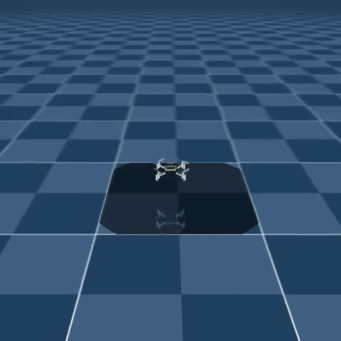

# Automous Drone Navigation using Reinforcement Learning

## Drone Hovering
Moves the drone to a spot right above it and have it stay in the area. The spot stays in the same location for each run.


## Random Point 
Moves the drone to a random spot and have it stay in the area. The spots location changes for each run.


## Multiple Targets
Moves the drone to a random spot and have it stay in the area. The spots location changes after each contact with the location.



## Follow the Line


## Results

Hardware: Google Colab L4

| Environment        | Model Type | Average Reward    | Total Training Steps | HuggingFace                                                      |
|--------------------|------------|-------------------|----------------------|------------------------------------------------------------------|
| DroneRacer-v0      | SAC        | 300.00 +/- 200.00 | 10,000,000            | [Link](https://huggingface.co/kuds/drone-racer-sac)             |
| DroneRacerDense-v0 | SAC        | _In progress_     | 10,000,000            | [Link](https://huggingface.co/kuds/drone-racer-dense-sac)       |

## Getting Started

### Installation

```bash
# Install the package in editable mode
pip install -e .

# With all optional dependencies (training, curve fitting, dev tools)
pip install -e ".[dev,train,curve]"
```

### Running Tests

```bash
make test
```

### Project Structure

```
src/rl_drone/
├── envs/                    # Gymnasium environments
│   ├── drone_hover.py       # Hover / random point / multi-target tasks
│   └── drone_racer.py       # Track-following racer task
├── callbacks/               # Stable-Baselines3 training callbacks
│   ├── video_record.py      # Record MP4 rollouts + per-step CSVs
│   ├── reformat_eval.py     # Convert evaluations.npz → CSV summary
│   ├── vec_normalize_save.py# Persist VecNormalize stats on new-best
│   ├── training_plots.py    # Auto-save learning-curve plots during training
│   └── config_save.py       # Persist hyperparams/config as JSON
└── utils/                   # Shared utilities
    ├── rewards.py           # Reward shaping functions
    ├── track.py             # Circular track generation
    ├── curve.py             # 3D spline curve fitting
    ├── model_xml.py         # MuJoCo model XML setup
    ├── plotting.py          # Shared matplotlib plot helpers
    └── paths.py             # build_run_paths / RunPaths artifact layout
```

The Jupyter notebooks in the root directory are the original Colab training
scripts. The `src/rl_drone/` package extracts their shared code into a
reusable, testable library.

### Training Artifact Layout

Every notebook calls `rl_drone.utils.paths.build_run_paths` to produce a
consistent directory tree for training artifacts. With Google Drive mounted at
`/content/gdrive`, a run writes into:

```
/content/gdrive/MyDrive/Finding Theta/BitCrazy/training jobs/<env_str>/<rl_type>/
└── <YYYY-MM-DD_HH-MM-SS>/    # one directory per training run
    ├── best_model.zip                    # from EvalCallback
    ├── best_model_vec_normalize.pkl      # from VecNormalizeSaveCallback
    ├── final_model.zip                   # saved after model.learn()
    ├── final_normalized_env.pkl          # VecNormalize stats (train)
    ├── final_normalized_env_val.pkl      # VecNormalize stats (eval)
    ├── evaluations.npz                   # from EvalCallback
    ├── <name_prefix>.csv                 # from ReformatEvalCallback
    ├── config.json                       # from ConfigSaveCallback
    ├── tensorboard/                      # TensorBoard event files
    ├── monitor/                          # Monitor wrapper CSV logs
    ├── checkpoints/                      # CheckpointCallback snapshots
    ├── plots/                            # TrainingPlotsCallback PNGs
    └── videos/                           # VecVideoRecorder MP4 + per-step CSV
```

`<env_str>` is one of `DroneHover`, `DroneRacer`, `MultipleTargets`,
`RandomPoint`; `<rl_type>` is the RL algorithm (e.g. `SAC`); `name_prefix` is
`f"{env_str}_{rl_type}".lower()` across all notebooks. Timestamps use
`%Y-%m-%d_%H-%M-%S` so run directories are safe on every filesystem.

When `use_google_drive=False`, the same layout is rooted at
`/content/training jobs/<env_str>/<rl_type>/` instead.

## Development Notes
- `VecNormalize`  can cause issue when used with a new environment along with a model that is already trained. It is good to save the VecNormalize if you want to use for further validation [Reinforcement Learning Tips and Tricks](https://stable-baselines3.readthedocs.io/en/master/guide/rl_tips.html)

## Finding Theta Blog Posts
- [The Unseen Hand: Guiding a Virtual Drone with Sparse and Dense Rewards](https://www.findingtheta.com/blog/the-unseen-hand-guiding-a-virtual-drone-with-sparse-and-dense-rewards)
